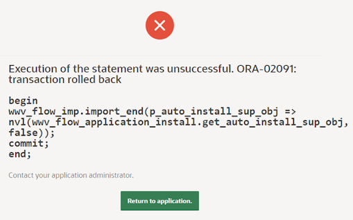

# Cards List UI Template Component

Cards List UI Design Template Component gives a clean card with Image, Detail and Action Buttons

- Usable as Single or Multiple

## Preview


## Demo Application
You can find a Demo Application [here](https://apex.oracle.com/pls/apex/r/luf/cards-list-ui)

## How to use
1. Download the plug-in file from the latest release
2. Import the plug-in file into your application
3. Create a new region of type "Cards List UI"
4. Add SQL Query like this

```sql
WITH card_json AS (
  SELECT '
[
  {
    logo: "https://imgpile.com/images/uBmLxP.png",
    title: "Hunter",
    subTitle: "Data access",
    description:
      "Hunter API makes it easy to find or verify professional email addresses.",
    apiLink: "https://hunter.io/api-documentation/v2"
  },
  {
    logo: "https://imgpile.com/images/uBmq0N.png",
    title: "Asana",
    subTitle: "Data access",
    description:
      "Customize the Asana experience, leverage your data with the Asana API.",
    apiLink: "https://asana.com/developers"
  },
  {
    logo: "https://imgpile.com/images/uBmAnW.png",
    title: "BlaBlaCar",
    subTitle: "Automation",
    description:
      "BlaBlaCars API allows to search for car sharing trips, just as the BlaBlaCars website does.",
    apiLink:
      "https://dev.blablacar.com/hc/en-us/sections/360002479480-Documentation"
  },
  {
    logo: "https://imgpile.com/images/uBmzdE.png",
    title: "Meteorologisk Institutt",
    subTitle: "Data access",
    description: "Weather and climate data.",
    apiLink: "https://api.met.no/weatherapi/documentation"
  },
  {
    logo: "https://imgpile.com/images/uBmOq1.png",
    title: "Mailchimp",
    subTitle: "Automation",
    description:  "Email marketing, ads, landing pages, and CRM tools to grow your business on your terms. ",
    apiLink: "https://developer.mailchimp.com/documentation/mailchimp/reference/overview/"
  },
  {
    logo: "https://imgpile.com/images/uBm8rr.png",
    title: "Stripe",
    subTitle: "Data access",
    description: "A suite of payment APIs that powers commerce for online businesses of all sizes.",
    apiLink: "https://stripe.com/docs/api"
  },
  {
    logo: "https://imgpile.com/images/uBmVvR.png",
    title: "Twilio",
    subTitle: "Data access",
    description: "Send and receive SMS and MMS messages as well as query meta-data about text messages ",
    apiLink: "https://www.twilio.com/docs/api"
  },
  {
    logo: "https://imgpile.com/images/uBmHUg.png",
    title: "Typeform",
    subTitle: "Data access",
    description: "Create, retrieve, update, and delete your typeforms, themes, and images.",
    apiLink: "https://developer.typeform.com/"
  },
  {
    logo: "https://imgpile.com/images/uBmoic.png",
    title: "WhatsApp Business",
    subTitle: "Automation",
    description: "WA Business API powers your communication with customers all over the world.",
    apiLink: "https://developers.facebook.com/docs/whatsapp"
  }
]
  ' AS json_data
  FROM DUAL
)
SELECT
  jt.logo,
  jt.title,
  jt.subTitle,
  jt.description,
  jt.apiLink
FROM
  card_json,
  JSON_TABLE(
    json_data,
    '$[*]'
    COLUMNS (
      logo VARCHAR2(100) PATH '$.logo',
      title VARCHAR2(100) PATH '$.title',
      subTitle VARCHAR2(100) PATH '$.subTitle',
      description VARCHAR2(500) PATH '$.description',
      apiLink VARCHAR2(200) PATH '$.apiLink'
    )
  ) jt
```

> For convenience, I'm querying a JSON, but you do not have to it this way.

5. Assign Attributes as below


## Actions
Assign Actions to the **Primary** (center/right) or **Secondary** (center/left) postition.

In the Redirect Link, you can use the **&APILINK.** substitution to bring through the target URL

Using a Link Attribute of **target="_blank"** opens in a new tab

Use a HOT button to highlight the button


## Upgrading from a previous version

If you encounter an ORA-02091...



... this is due to APEX bug 36147888 related to the import feature. [See here for more details](https://twitter.com/mennooo/status/1742194606454743264).

To resolve this:
1. In your app, make a note of the settings of all Actions in all occurrences of the plugin.
2. Remove all Actions from all occurrences of the plugin in your app.
3. Import the Plug-in (It will be succesfully imported this time).
4. Manually restore the settings of all Actions.


## Images

Images work best with a 60x60 pixel resolution i.e


### 23.2.1 (Jan 2024)

#### Enhancements
- Aligned to the Universal Theme
- Dark Mode support

### 23.1.1 (Aug 2023)
- Initial Release

## Credits

Kudos to G Rohit @ https://codepen.io/grohit/embed/PozVdow

Adapted to APEX by Matt Mulvaney (https://x.com/Matt_Mulvaney)

## Donations

Donations to [Saint Michael's Hospice](https://saintmichaelshospice.org/support-our-work/donate/one-off-donation/) are welcomee
